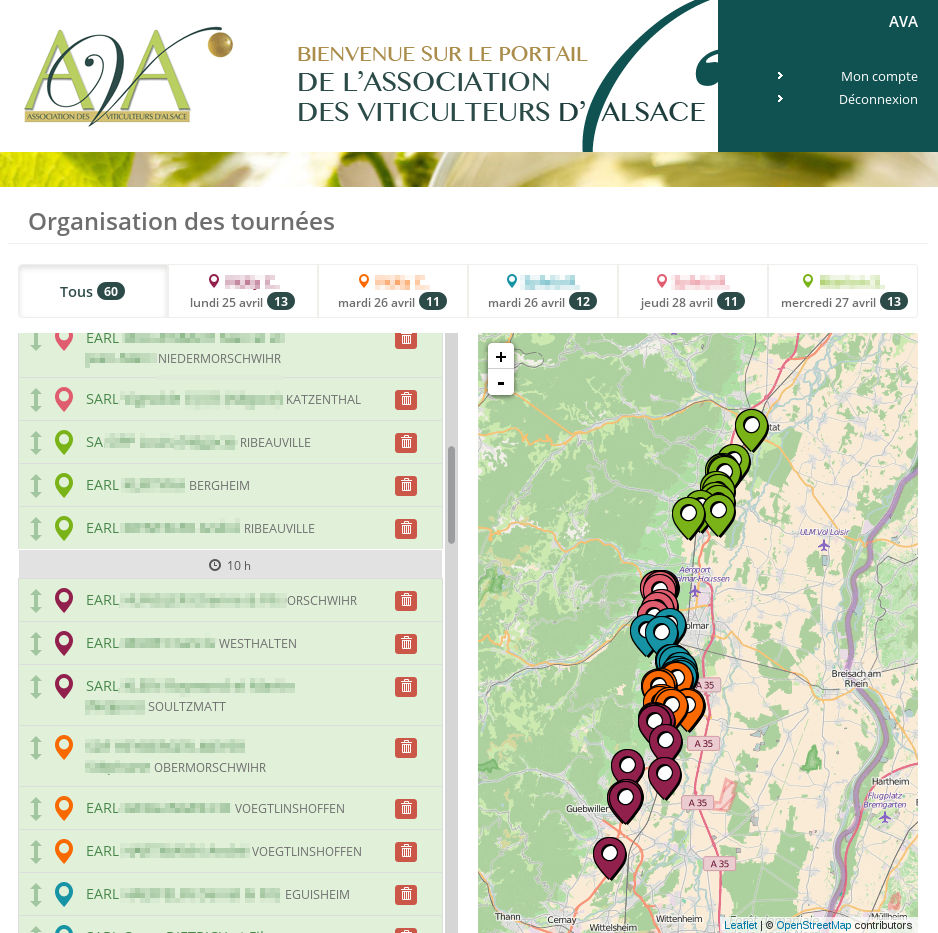

OpenODG
===

Projet de dématérialisation informatique des activités d'un syndicat viticole (AOC, IGP).

Principales fonctionnalités
---------------

- Déclaration de revendication
- Récupération de la DR, SV11, SV12 à partir de prodouane
- Récupération du parcellaire à partir du CVI
- Déclaration d'irrigabilité
- Affectation et identification parcellaire
- Facturation
- Organisation de dégustations
- Gestion des habilitations
- Gestion de documents
- Gestion des opérateurs
- Gestion de contacts

License utilisée
----------------

Ce logiciel est mis à disposition en [licence AGPL](LICENSE)

Projet déployé
---------------

Le projet est actuellement en cours d'utilisation par  : 

* L'Association des Viticulteurs d'Alsace : https://declaration.ava-aoc.fr/
* Le Syndicat des Côtes du Rhône : https://declaration.syndicat-cotesdurhone.com/
* Le Syndicat des Côtes de Provence : https://declaration.syndicat-cotesdeprovence.com/
* Syndicats du Val de Loire : https://teledeclaration.vinsvaldeloire.pro/
* La Fédération des Vins de Nantes : https://declaration.vinsdenantes.com/

Technologies utilisées
----------------------

Ce projet utilise les technologies libres suivantes :

* Symfony 1.4
* Couchdb
* php on couch
* CAS
* phpCAS
* TcPDF
* Elastic Search
* Elastica

Installation
------------

[Documentation d'installation](https://github.com/24eme/ava/blob/master/doc/Installation.md "Documentation d'installation")

Tests
----

Créer project/bin/config.inc à partir du project/bin/config.inc.example

```
cp project/bin/config.inc{.example,}
```

Configurer project/bin/config.inc :

```
WORKINGDIR=<your_working_dir>/project
COUCHTEST=http://localhost:5984/openodg_test
```

Pour lancer les tests :

```
cd project
bash bin run_test.sh <application> # Pour lancer les tests d'une application
bash bin run_test.sh <application> <specifique_test> # Pour lancer les tests d'un jeu de test en particulier d'une application
bash bin run_test.sh all # Pour lancer les tests sur toutes les applications
```

Aperçu de l'application pour l'Association des Viticulteurs d'Alsace
-----------------------



[Voir plus de captures d'écran de l'application](doc/captures/README.md)
