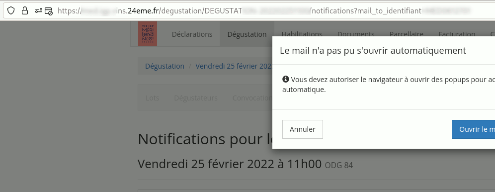
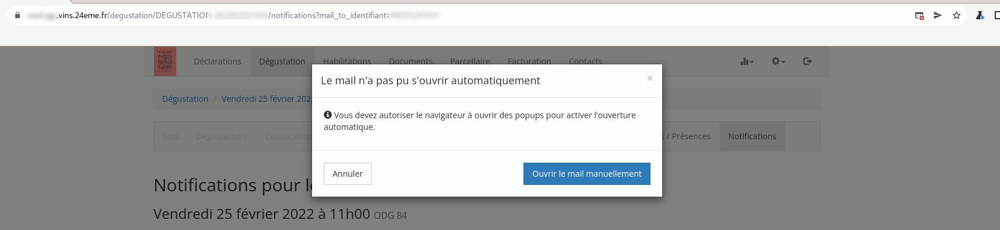

# Autorisation de Popup lors des notifications

Pour l'envoi des notifications par mail, il faut autoriser les popup. Voici la procédure à réaliser pour les différents navigateurs :

## Firefox

## Chrome / Chromimum

