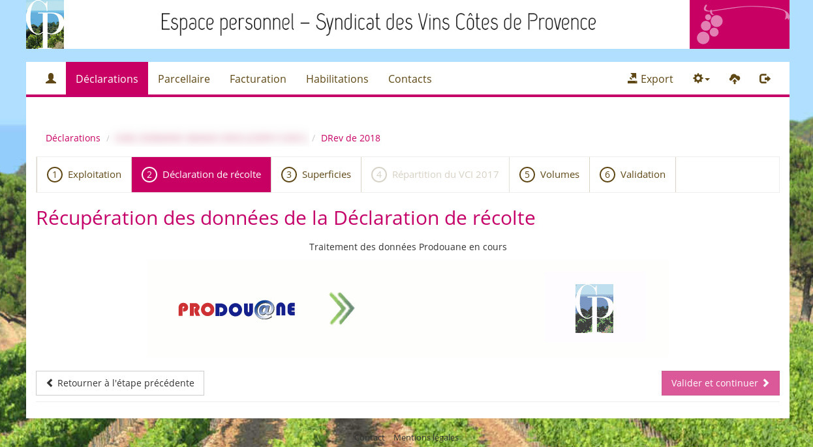
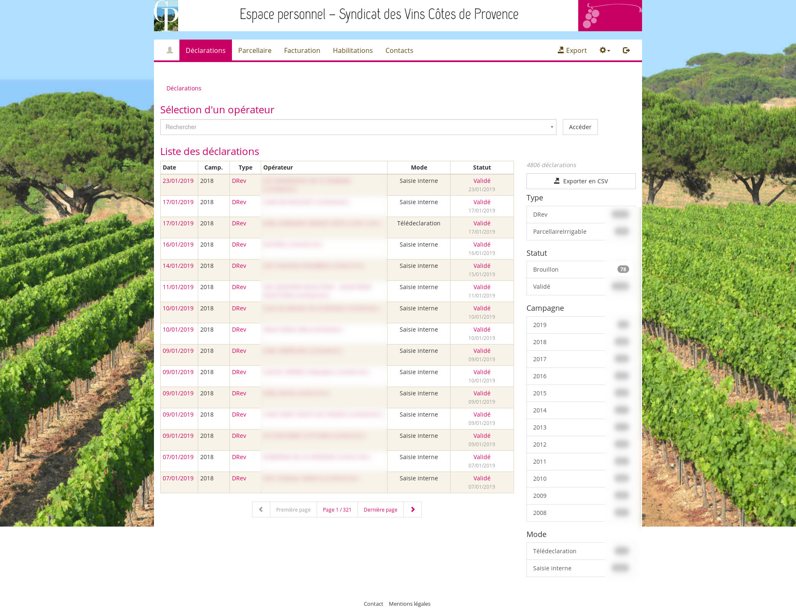

# Déclaration de Revendication

## Interfaces de télédéclaration

Depuis leur espace, les adhérents peuvent déclarer leur revendication en quelques étapes simples. Ces interfaces permettent également le suivi du VCI.

### Récupération automatique de la DR

Capture du portail du syndicat des Cotes de provence

### Saisie par l'opérateur des valeurs des volumes

Capture issue du portail alsacien

## Interface de suivi des télédéclarations

Une interface d'administration permet de suivre les télédéclarations et les saisies internes. Pour les syndicats qui le souhaitent, il est possible de vérifier et valider toutes les déclarations télédéclarée.

Une technologie de filtre permet de sélectionner les documents, années ou statut du document. Une recherche par opérateur est également disponible pour consulter les documents de tous chaque opérateur
