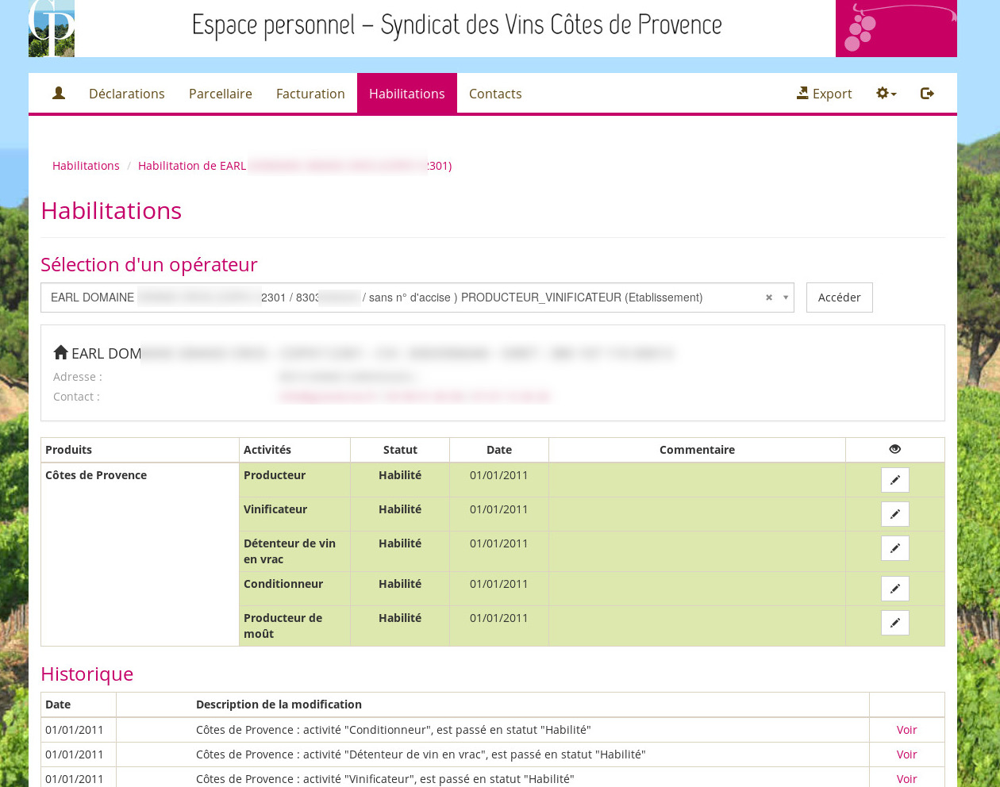

# Habilitation

Le module habilitation est relié aux autres modules. Ainsi, si un opérateur revendique ou produit un produit pour lequel il n'est pas habilité, une alerte est levée auprès du syndicat.

De même le module [contact](contacts.md) intègre ces informations pour pouvoir faire des exports (mailing, ...) sur la base des informations liées à l'habilitation.
