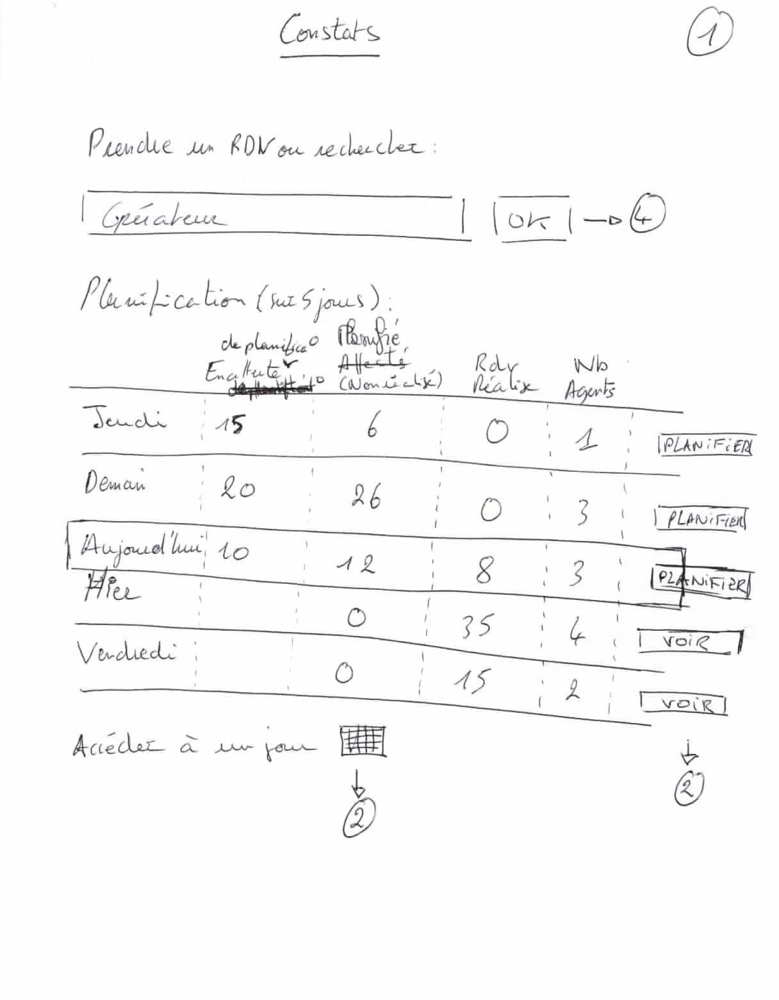
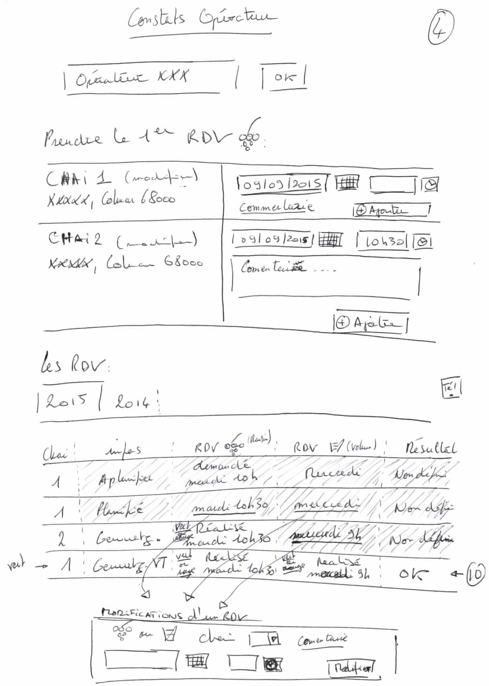
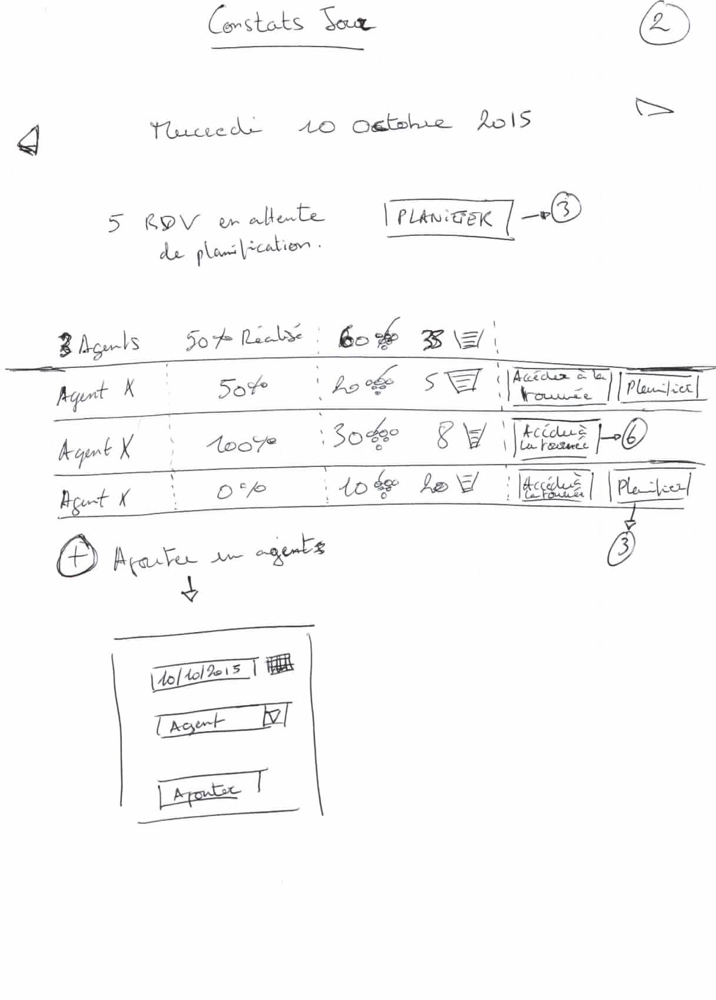
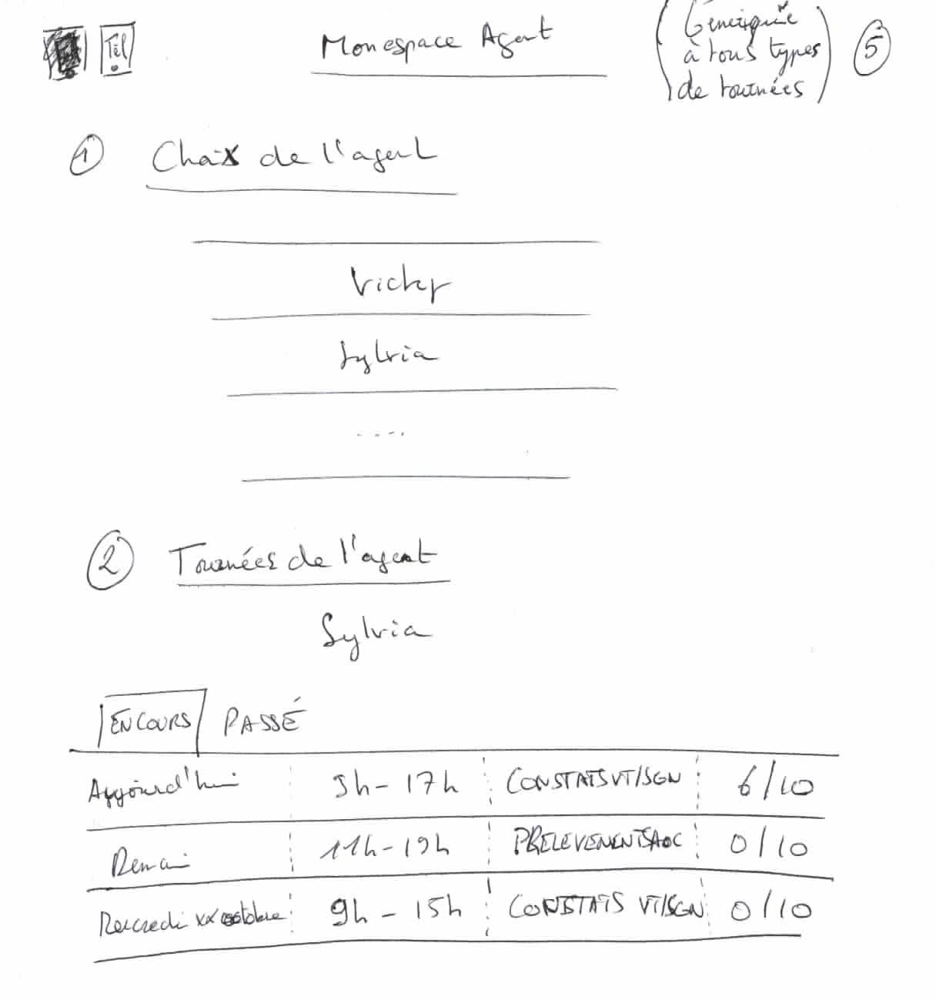
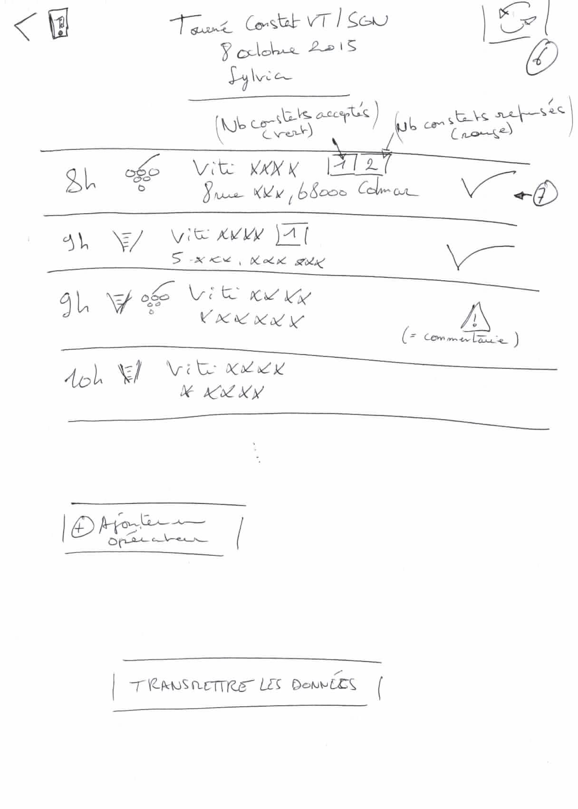
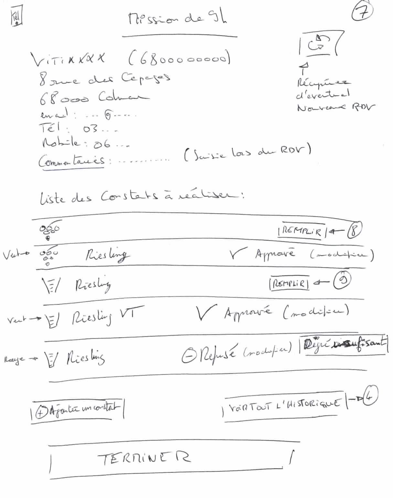
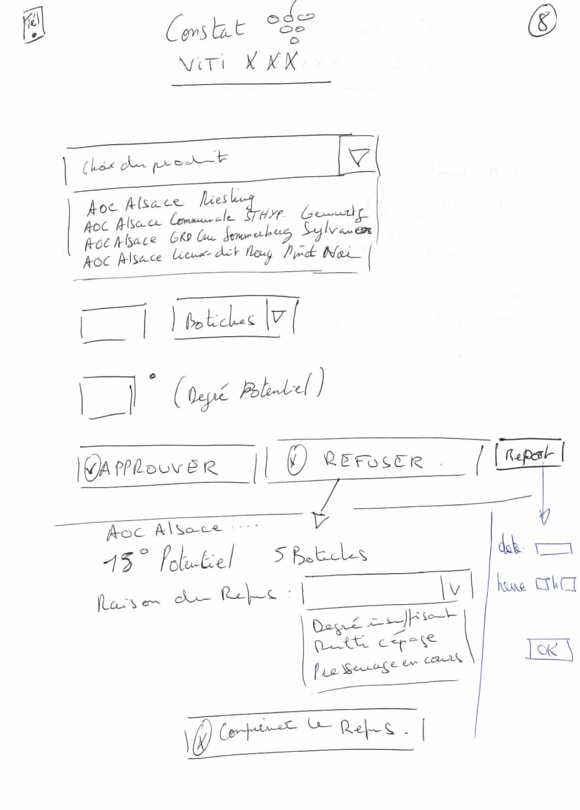
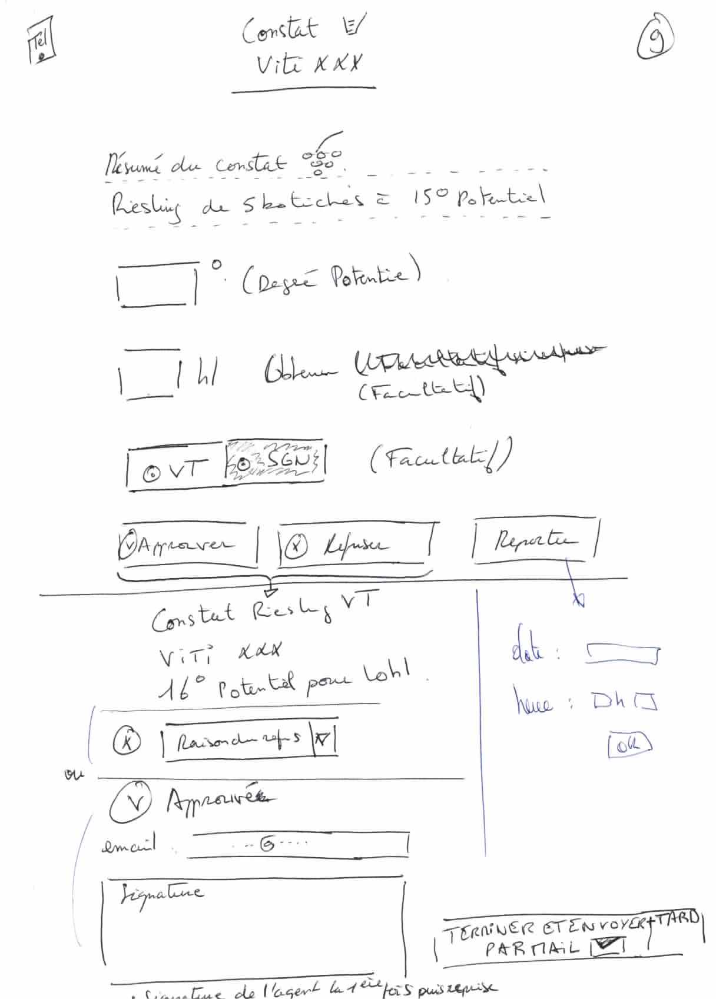
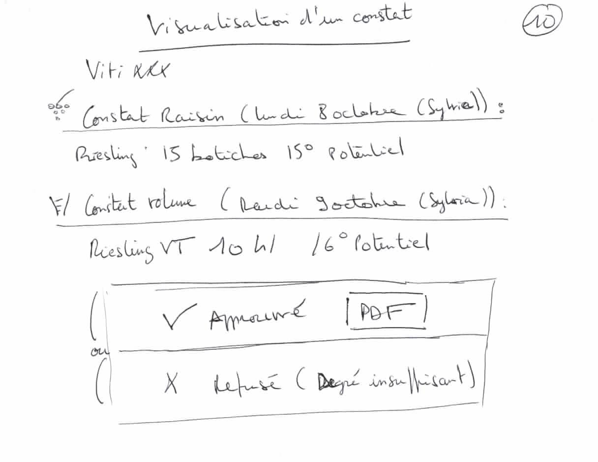
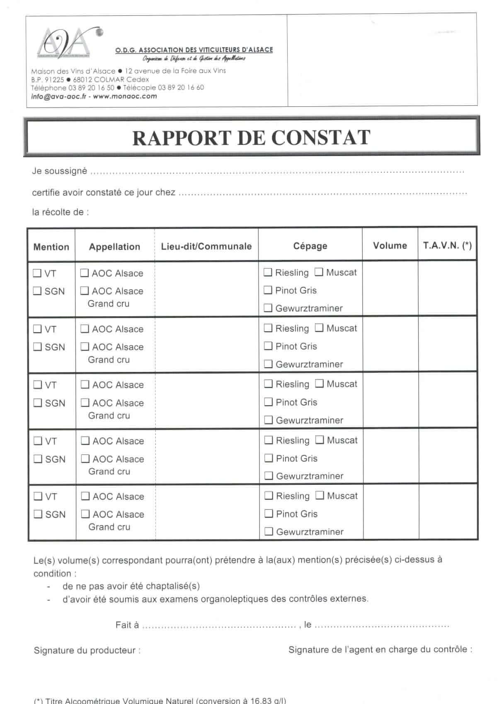

#Mockups pour les constats VT/SGN

##Accueil des général des constats

Cet écran à deux usages bien distinct : 

* La prise de rendez-vous
* La planification grâçe une vision sur 5 jours de la planification

 - 

## Espace opérateur et prise de rendez-vous

L'usage principal de cet écran est la prise de rendez-vous pour un chai

 - 

## Résumé de la planification d'une journée

Accessible depuis la page d'accueil cet écran récapitule la planification et la réalisation des constats pour une journée

 - 

## Planification et organisation

Cet écran permet d'affecter et planifier les rdv à des agents et des crénaux horaires.

 - 

## Espace des agents

Cet écran est destiner aux agents pour trouver les tournées qui leur sont destinées (depuis leur smartphone).

 - 

## Tournée

Liste des différentes visites de la journée

 - 

## Fiche mission d'un opérateur

Récapitulatif des constats à effectuer pour un opérateur

 -

## Saisie du constat raisin

 -

## Saisie du constat volume

 -

## Visualisation d'un constat

La visualisation d'un constat avec téléchargement PDF (accessible depuis l'espace d'un opérateur).

 -

## Rapport de constat actuellement utilisé

 -