#Mockups pour la dégustation

##Organisation d'une dégustation

 0. Workflow de la création d'une dégustation :

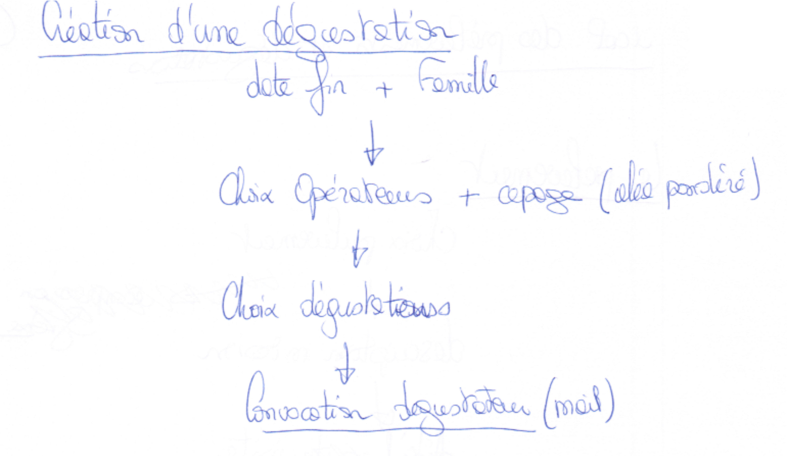 - 

 2. Écran de création :

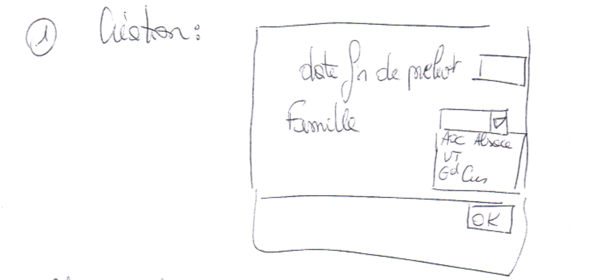 - 

  -

 3. Écran de choix des opérateurs :

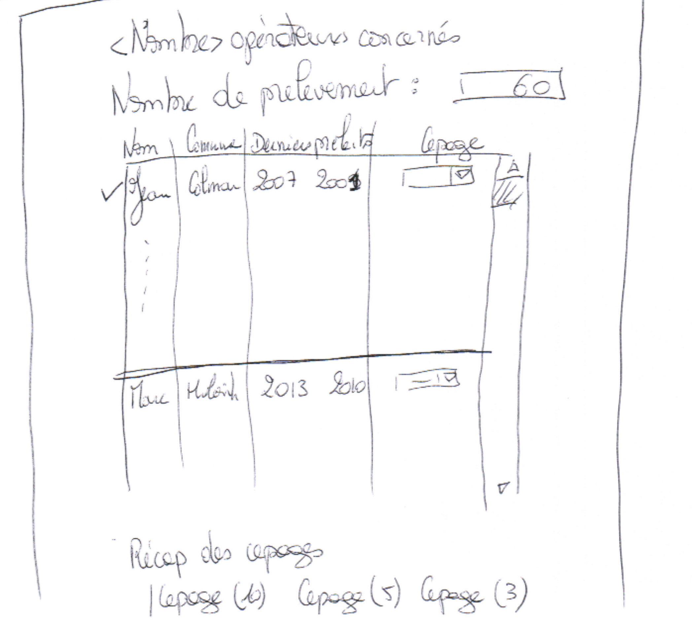 -

 4. Écran d'initialisation du choix des dégustateurs :

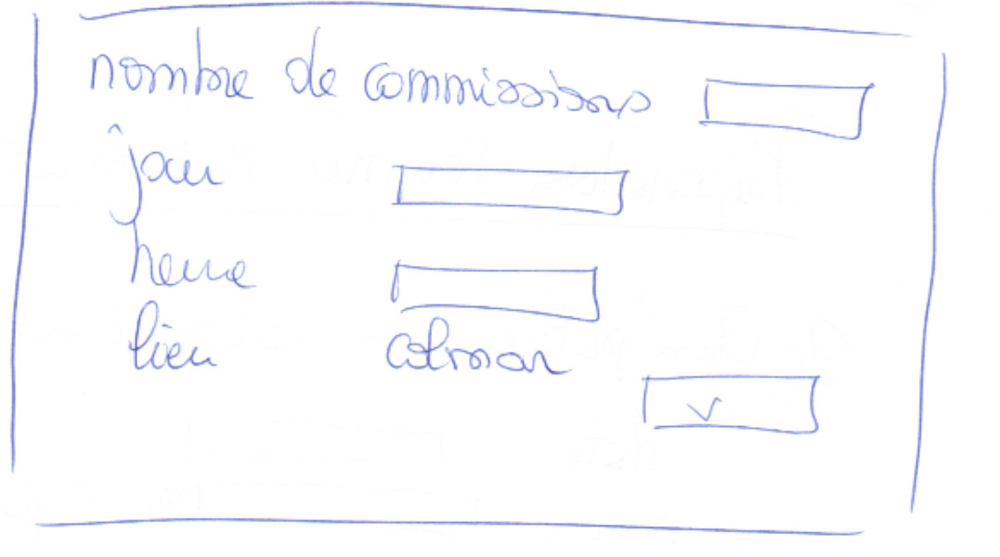 -

 5. Écran du choix des dégustateurs :

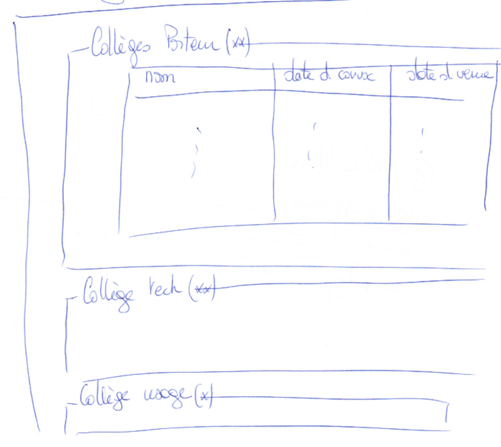 -

##Préparation d'une tournée de prélevement

 1. Workflow de la préparation d'une tournée de prélèvement :

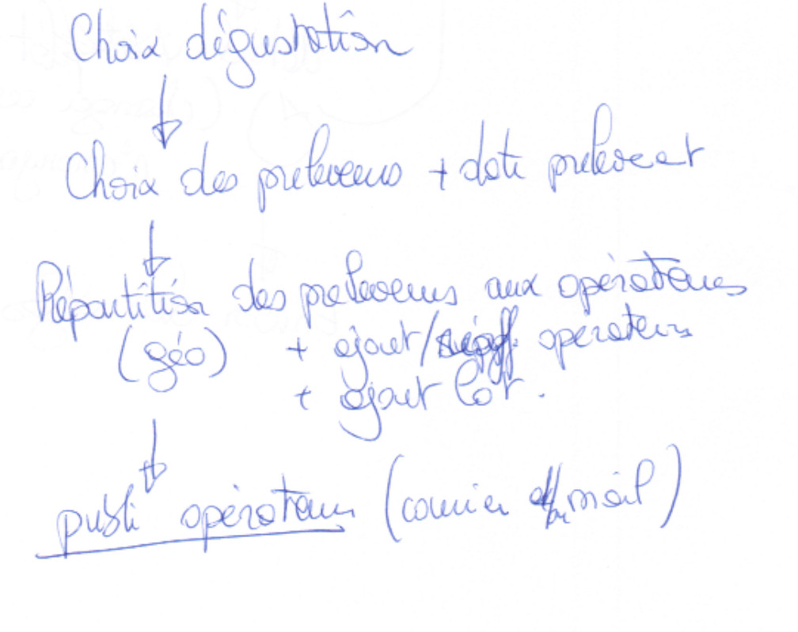 -

 2. Écran Date de prélèvement et de choix des préleveurs :

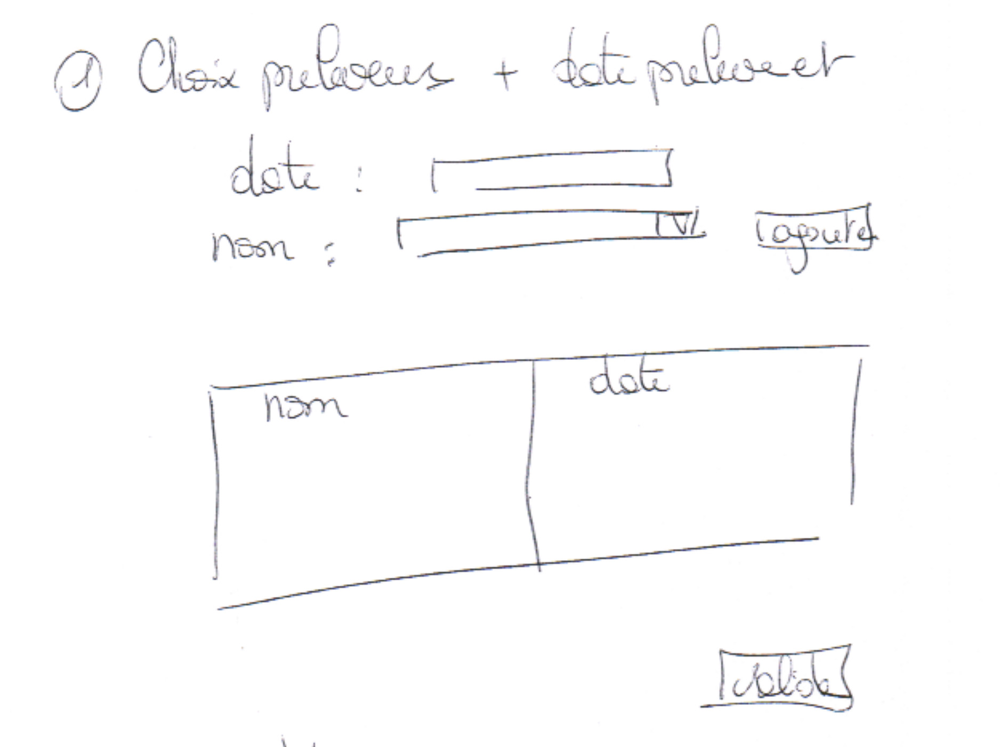 -

 3. Écran d'organisation de la tournée en affectant des préleveurs à des opérateurs :

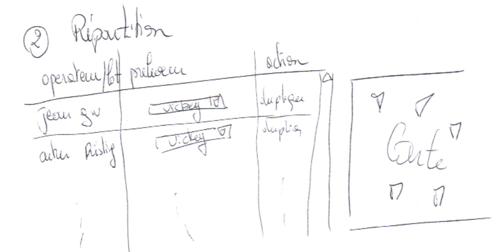 -

##Le prélèvement lors d'une tournée d'un préleveur

 0. Workflow du prélèvement :

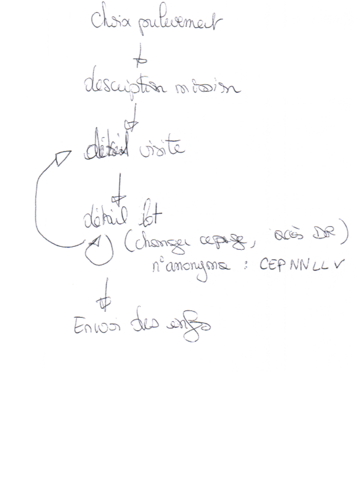 -

 1. Écrans de prélèvement :

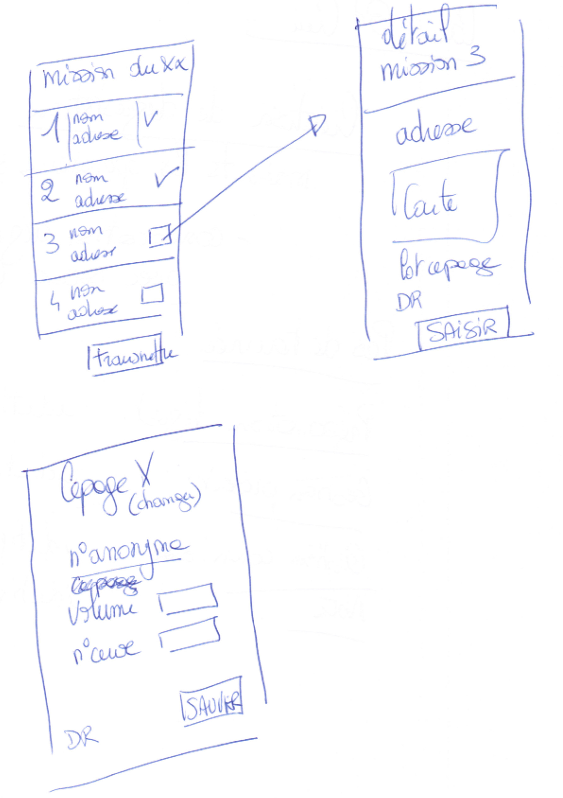 -

Ces écrans seront prévus pour être utilisable depuis un `smartphone`.

##Préparation d'une séance de dégustation

 1. Écran permettant d'affecter des vins à des commissions :

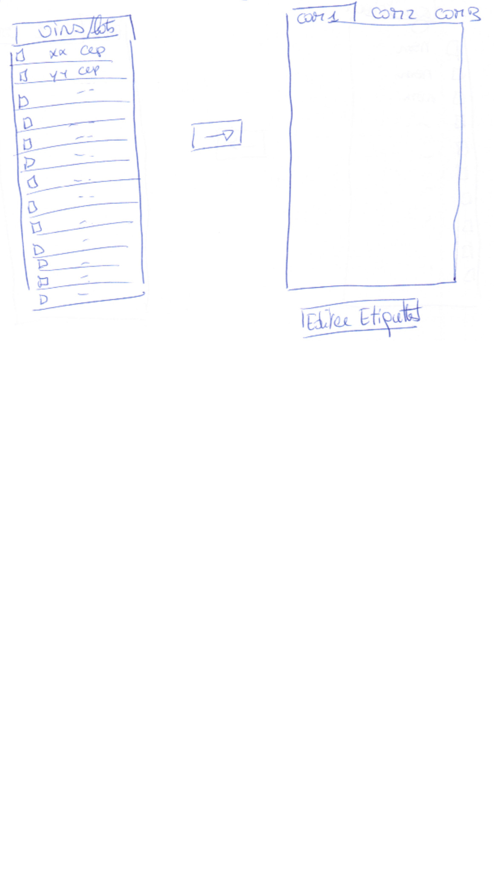 -

##Gestion des présents

 1. Écran permettant d'indiquer qui a annoncé se présence :

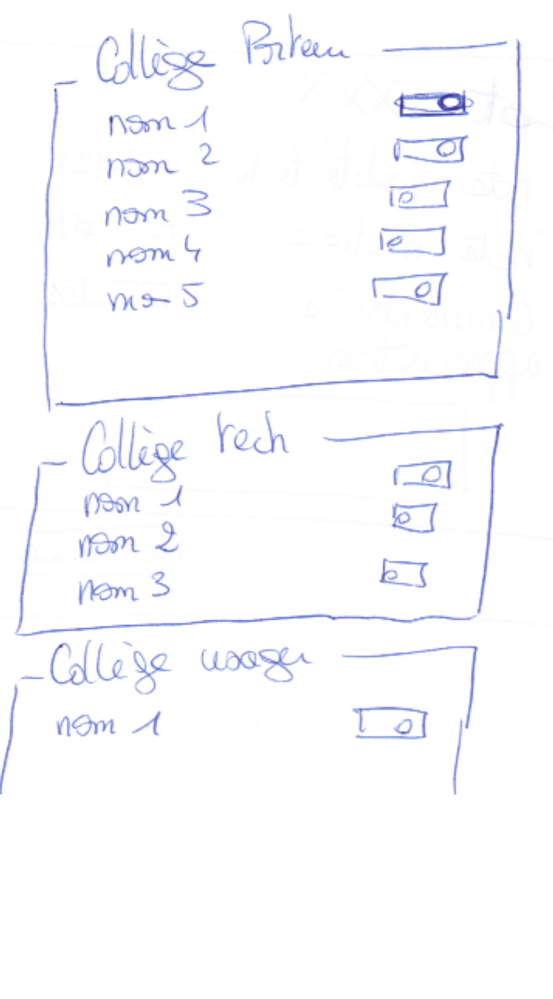 -

Ce développement est peut être optionnel et peut être vu comme redondant par rapport à l'écran suivant.

##Affectation des dégustateur

 1. Écran permettant d'affecter des dégustateurs à des commissions :

 -

##Enregistrement des notes d'une commission

 1. Écran d'enregistrement des notes d'un vin :

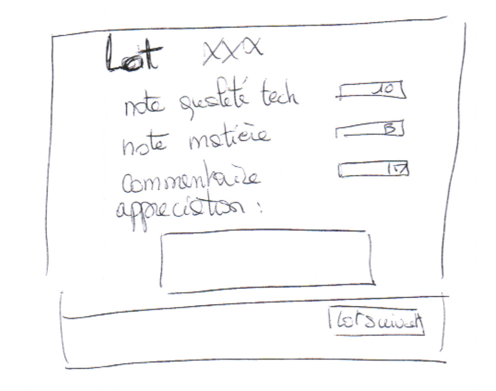 -

Cette navigation sera prévue pour être utilisable depuis une tablette.

##Visualisation d'une dégustation

 1. Écran de visualisation d'une dégustation avec envoi du publipostage :

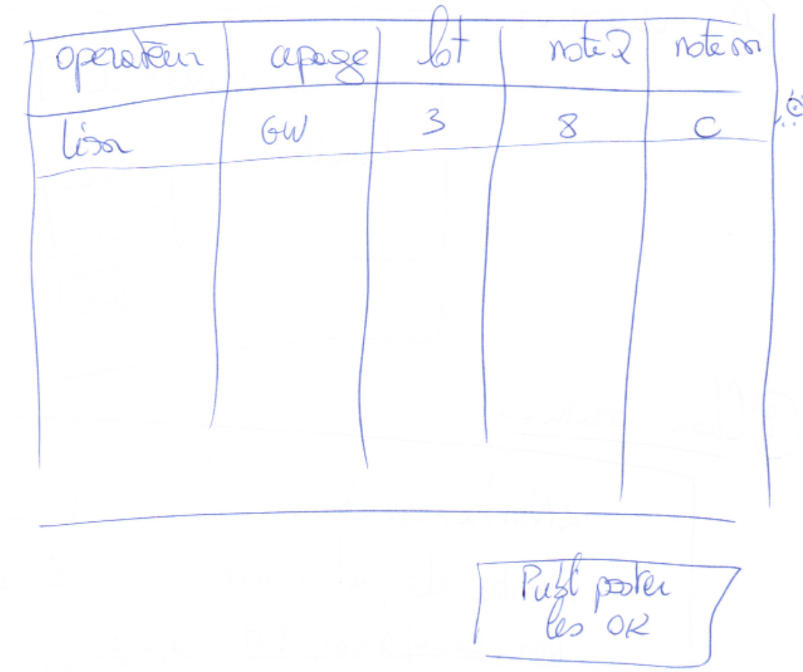 -

##Fiche contact

 1. Écran de consultation d'une fiche contact :

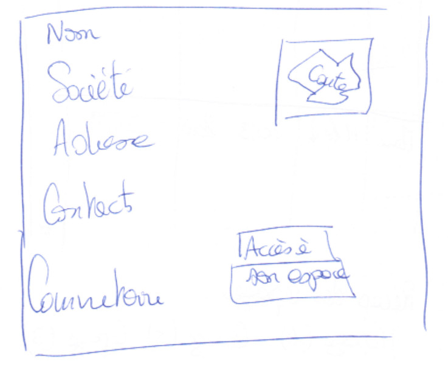 -

L'accès des documents se fait par un accès direct à l'espace de l'utilisateur.

##Cas des Grands crus

Pour la gestion des Grands crus, les partie "Préparation de la dégustation", "Gestion des présents", "Gestion des commissions", "Enregistrement des notes" et "Visualisation d'une dégustation" seront communes.

Pour la "création d'une dégustation", le premier écran permettra de saisir un lieu de dégustation à la place de "Colmar". Le second écran sélectionnera tous les opérateurs plutot qu'un échantillon.

Il n'y aura pas d'étapes "Organisation des tournées" et "Prélèvement".

